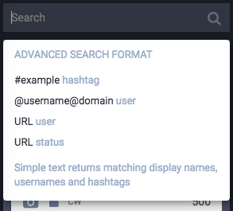

# Web > desktop > drawer

## drawer__header

* drawer__tab: hover

## search

* search__input: placeholder

## compose-form

* reply review
* account not locked warning (unlisted toot, txt contains link)
* toot unlisted warning
* image undo / crop actions: hover
* toot msg input: placeholder
* warning msg input: placeholder
* img description: placeholder
* add media btn: hover
* status privacy btn: hover, change icon
* sensitive (eye) btn: hover, active, locked (when CW)
* CW btn: hover, active
