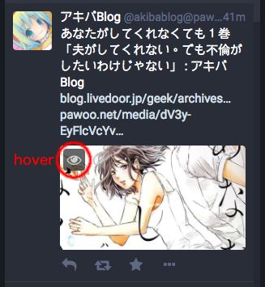
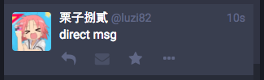
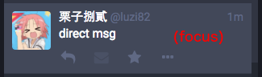
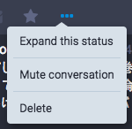
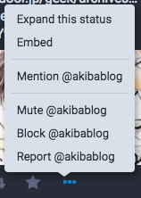
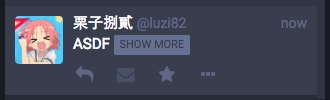
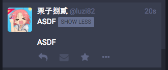

# Web > desktop > region

## region

* setting btn: hover, active

## setting

* setting btn: hover, active
* switch btn: on/off, hover
* filter text input: placeholder
* pin btn: pin/unpin, hover
* move left,right btn: hover

## article

* toot can be focused
* toot contains link
* show more/less: hover
* reply btn: hover
* boost btn: hover, active, disabled (by direct msg)
* fav btn: hover, active
* menu btn: hover, active
* menu: hover
